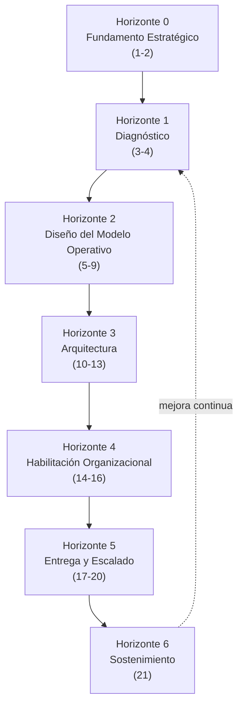

# 01 · Metodología — 7 Horizontes, 21 Fases

Los 21 pasos del framework se agrupan en **7 horizontes** de transformación. Cada
horizonte tiene un **gate de salida** (criterio de aprobación) que debe cumplirse antes
de avanzar al siguiente — igual que en un engagement de consultoría tipo Accenture/
McKinsey (Diagnose → Design → Deliver → Run).

Cada fase se documenta con: **Objetivo · Preguntas clave · Actividades · Entregables ·
Entradas de trazabilidad · Gate de salida**.

---

## Horizonte 0 — Fundamento Estratégico

### Fase 1 · Entender estrategia, objetivos y modelo de negocio
- **Objetivo**: anclar toda la transformación a la estrategia real del negocio.
- **Preguntas clave**: ¿Cuál es la ventaja competitiva buscada? ¿Qué objetivos
  (financieros, de mercado, de riesgo) son innegociables? ¿Qué modelo de negocio se
  quiere proteger o disrumpir?
- **Actividades**: entrevistas a C-level, revisión de plan estratégico, mapeo de
  modelo de negocio (ej. Business Model Canvas), identificación de KPIs corporativos.
- **Entregables**: Mapa de Estrategia, Árbol de Objetivos, Business Model Canvas.
- **Entrada de trazabilidad**: crea las entidades `Strategy` y `Objective`.
- **Gate de salida**: objetivos validados y priorizados por el sponsor ejecutivo.

### Fase 2 · Evaluación de madurez empresarial y tecnológica
- **Objetivo**: establecer la línea base (baseline) de madurez.
- **Actividades**: assessment de madurez por dominio (negocio, datos, aplicaciones,
  organización, IA/agentic), benchmarking sectorial.
- **Entregables**: Reporte de Madurez (scorecard por dominio), Heatmap de madurez.
- **Entrada de trazabilidad**: vincula `Objective` → dominios de `Capability` evaluados.
- **Gate de salida**: baseline de madurez aceptado por el cliente.

---

## Horizonte 1 — Diagnóstico

### Fase 3 · Análisis de brechas (gap analysis)
- **Objetivo**: identificar la distancia entre el estado actual y el objetivo.
- **Actividades**: comparar madurez actual vs. madurez objetivo por capacidad/proceso,
  causa-raíz de brechas.
- **Entregables**: Matriz de Gaps, causas raíz priorizadas.
- **Entrada de trazabilidad**: crea `Capability Gap` ligado a `Capability` y `Objective`.
- **Gate de salida**: gaps validados y aceptados como base de priorización.

### Fase 4 · Priorización de dominios, procesos y oportunidades
- **Objetivo**: decidir dónde invertir primero.
- **Actividades**: scoring de impacto/esfuerzo/riesgo, votación con stakeholders,
  matriz de priorización (valor vs. factibilidad).
- **Entregables**: Ranking de dominios/procesos, Backlog priorizado de oportunidades.
- **Entrada de trazabilidad**: crea `Opportunity` (candidata) ligada a `Capability`.
- **Gate de salida**: portafolio de prioridades aprobado por el comité de gobierno.

---

## Horizonte 2 — Diseño del Modelo Operativo Objetivo

### Fase 5 · Diseño del modelo operativo objetivo (Target Operating Model)
- **Objetivo**: definir cómo operará la empresa (personas, procesos, tecnología, datos,
  gobierno) en el estado futuro.
- **Entregables**: Target Operating Model (TOM), mapa de capacidades objetivo.
- **Entrada de trazabilidad**: actualiza `Capability` con estado objetivo.
- **Gate de salida**: TOM validado por liderazgo de negocio y tecnología.

### Fase 6 · Rediseño de procesos
- **Objetivo**: rediseñar procesos priorizados antes de automatizar/agentizar.
- **Actividades**: mapeo as-is, diseño to-be, eliminación de desperdicio, definición de
  puntos de decisión humano vs. sistema.
- **Entregables**: mapas de proceso to-be (BPMN o equivalente), matriz de decisión.
- **Entrada de trazabilidad**: crea/actualiza `Process`, ligado a `Capability`.
- **Gate de salida**: procesos to-be aprobados por dueños de proceso.

### Fase 7 · Diseño de la red de agentes alineada al negocio
- **Objetivo**: diseñar la red de agentes (agentic network) que soportará los procesos
  rediseñados — **diseño**, no despliegue.
- **Actividades**: identificar roles de agente por proceso, definir orquestación,
  puntos de control, límites de autonomía.
- **Entregables**: Blueprint de Red de Agentes, catálogo de roles de agente.
- **Entrada de trazabilidad**: convierte `Opportunity` en `Initiative` (tipo agentic).
- **Gate de salida**: blueprint validado con arquitectura y riesgo/compliance.

### Fase 8 · Diseño de interacción Humano-Agente-Sistema
- **Objetivo**: definir cómo colaboran personas, agentes y sistemas (HITL, HOTL,
  autonomía supervisada, escalamiento).
- **Entregables**: modelo de interacción H-A-S, matriz de niveles de autonomía por
  proceso.
- **Entrada de trazabilidad**: enriquece `Initiative` con nivel de autonomía objetivo.
- **Gate de salida**: modelo de interacción aprobado por negocio + riesgo.

### Fase 9 · Caso de negocio y roadmap de transformación
- **Objetivo**: cuantificar valor y secuenciar la transformación.
- **Entregables**: Business Case (costo/beneficio/ROI/payback), Roadmap de
  transformación multi-horizonte.
- **Entrada de trazabilidad**: crea `Roadmap` ligado a todas las `Initiative`.
- **Gate de salida**: business case y roadmap aprobados por el comité ejecutivo.

---

## Horizonte 3 — Arquitectura

### Fase 10 · Arquitectura empresarial
- **Entregables**: arquitectura de negocio, de aplicaciones y de información (vista
  EA consolidada, ej. TOGAF-like).
- **Entrada de trazabilidad**: ancla `Initiative` a componentes de arquitectura.
- **Gate de salida**: arquitectura de referencia aprobada por Arquitectura Empresarial.

### Fase 11 · Arquitectura de tecnología, datos y nube
- **Entregables**: arquitectura de referencia tecnológica/datos/cloud, principios de
  integración.
- **Gate de salida**: arquitectura técnica validada por seguridad e infraestructura.

### Fase 12 · Gobierno de datos
- **Entregables**: modelo de gobierno de datos (propiedad, calidad, linaje,
  clasificación), políticas de acceso.
- **Gate de salida**: marco de gobierno de datos aprobado por el Data Office/CDO.

### Fase 13 · Gobierno de IA y IA responsable
- **Entregables**: marco de gobierno de IA (riesgo, ética, explicabilidad,
  cumplimiento normativo), políticas de uso de agentes.
- **Gate de salida**: marco de IA responsable aprobado por Riesgo/Legal/Compliance.

---

## Horizonte 4 — Habilitación Organizacional

### Fase 14 · Rediseño organizacional
- **Entregables**: nueva estructura organizativa, roles y modelos de gobernanza de
  decisión humano-agente.
- **Gate de salida**: diseño organizacional aprobado por RRHH y liderazgo.

### Fase 15 · Habilidades, entrenamiento, upskilling y gestión del cambio
- **Entregables**: matriz de brechas de habilidades, plan de upskilling, plan de
  gestión del cambio (comunicación, adopción, resistencia).
- **Gate de salida**: plan de cambio y capacitación aprobado.

### Fase 16 · Quick wins y pilotos
- **Objetivo**: generar prueba de valor rápida antes de escalar.
- **Entregables**: resultados de pilotos, lecciones aprendidas, casos de éxito.
- **Entrada de trazabilidad**: marca `Initiative` piloto como `Validated`.
- **Gate de salida**: pilotos exitosos con evidencia cuantificada de valor.

---

## Horizonte 5 — Entrega y Escalado

### Fase 17 · Implementación por dominio
- **Entregables**: dominios de negocio transformados end-to-end (uno a la vez).
- **Gate de salida**: dominio operando con KPIs objetivo alcanzados.

### Fase 18 · Automatización end-to-end
- **Entregables**: procesos completos automatizados/agentizados de punta a punta.
- **Gate de salida**: automatización end-to-end validada en producción.

### Fase 19 · Escalado a nivel empresa
- **Entregables**: plan y ejecución de escalado multi-dominio/multi-unidad de negocio.
- **Gate de salida**: escalado replicado con gobierno consistente.

### Fase 20 · Empresa Autónoma plena
- **Entregables**: operación autónoma extendida con supervisión humana estratégica.
- **Gate de salida**: KPIs de autonomía y valor sostenidos en el tiempo.

---

## Horizonte 6 — Sostenimiento

### Fase 21 · Gobierno continuo y mejora continua
- **Objetivo**: sostener y mejorar la Empresa Autónoma en el tiempo.
- **Actividades**: revisión periódica de madurez, reentrenamiento de la estrategia de
  agentes, auditoría de gobierno de datos/IA, ciclo de mejora continua.
- **Entregables**: cadencia de revisión de gobierno, dashboard de madurez continua.
- **Entrada de trazabilidad**: retroalimenta `Objective`/`Strategy` → reinicia el ciclo
  en el Horizonte 1 para el siguiente dominio u oportunidad.
- **Gate de salida**: N/A — es un ciclo continuo (no cierra, retroalimenta).

---

## Resumen de entregables por horizonte

| Horizonte | Entregable maestro |
|---|---|
| 0. Fundamento Estratégico | Mapa de Estrategia + Reporte de Madurez |
| 1. Diagnóstico | Matriz de Gaps + Backlog Priorizado |
| 2. Diseño del Modelo Operativo | TOM + Procesos To-Be + Blueprint de Agentes + Business Case/Roadmap |
| 3. Arquitectura | EA + Arquitectura Técnica + Gobierno de Datos/IA |
| 4. Habilitación Organizacional | Diseño Org + Plan de Cambio + Resultados de Pilotos |
| 5. Entrega y Escalado | Dominios Transformados + Automatización E2E + Escalado |
| 6. Sostenimiento | Dashboard de Madurez Continua |
