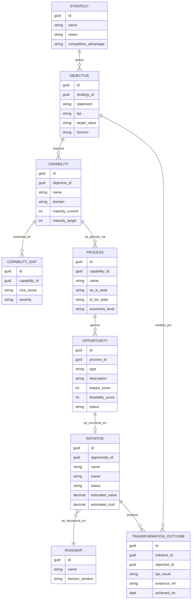

# 02 · Modelo de Trazabilidad

La trazabilidad completa es el activo central de AETP: cada decisión debe poder
explicarse retrocediendo hasta la estrategia, y cada objetivo estratégico debe poder
mostrarse hacia adelante hasta el resultado de transformación que produjo.

```
Strategy → Objective → Capability → Process → Opportunity → Initiative → Roadmap → Transformation Outcome
```

## 1. Diagrama de entidades



## 2. Diccionario de entidades

| Entidad | Definición | Se crea en (fase) | Se referencia hacia adelante en |
|---|---|---|---|
| `Strategy` | Estrategia corporativa o de unidad de negocio que ancla toda la transformación | Fase 1 | `Objective` |
| `Objective` | Objetivo medible derivado de la estrategia (KPI + meta + horizonte) | Fase 1 | `Capability`, `TransformationOutcome` |
| `Capability` | Capacidad de negocio necesaria para cumplir un objetivo, con madurez actual/objetivo | Fase 2, actualizada en Fase 5 | `CapabilityGap`, `Process` |
| `CapabilityGap` | Brecha identificada entre madurez actual y objetivo de una capacidad | Fase 3 | Prioriza `Opportunity` |
| `Process` | Proceso de negocio (as-is/to-be) que ejecuta una capacidad | Fase 6 | `Opportunity` |
| `Opportunity` | Oportunidad de mejora, IA o agente identificada sobre un proceso | Fase 4, enriquecida en Fase 7-8 | `Initiative` |
| `Initiative` | Iniciativa de transformación concreta y financiada (proyecto/programa) | Fase 9 | `Roadmap`, `TransformationOutcome` |
| `Roadmap` | Secuencia temporal de iniciativas por horizonte | Fase 9 | Ejecución (Fases 16-20) |
| `TransformationOutcome` | Resultado medido de una iniciativa frente al objetivo original | Fase 21 (medición continua) | Retroalimenta `Objective`/`Strategy` |

## 3. Reglas de integridad de trazabilidad

1. Ninguna `Opportunity` puede existir sin un `Process` (o al menos una `Capability`)
   asociado — **nunca se identifican oportunidades de IA/agentes en el vacío**.
2. Ninguna `Initiative` puede pasar a estado `Approved` sin `estimated_value` y
   `estimated_cost` (business case cuantificado).
3. Todo `TransformationOutcome` debe enlazar de vuelta al `Objective` original — si no
   hay enlace, el resultado no cuenta como evidencia de transformación (rompe la regla
   de "governance before autonomy": no se puede afirmar valor sin trazabilidad).
4. Los niveles de autonomía (`Process.autonomy_level`) solo pueden incrementarse si
   existe un marco de gobierno de IA aprobado (Fase 13) para el dominio correspondiente.
5. Cambios retroactivos en `Strategy` u `Objective` deben re-evaluar todas las
   `Capability`/`Opportunity`/`Initiative` descendientes (recalculo de alineamiento).

## 4. Vista de "Strategy-to-Outcome" (uso típico en la plataforma)

Cualquier pantalla de detalle en AETP (una iniciativa, un proceso, una capacidad) debe
exponer un breadcrumb de trazabilidad, por ejemplo:

```
Estrategia: "Liderazgo en experiencia de cliente omnicanal"
  └─ Objetivo: "Reducir tiempo de resolución de reclamos en 40%"
       └─ Capacidad: "Gestión de reclamos"  (madurez 2 → objetivo 4)
            └─ Proceso: "Resolución de reclamos nivel 2"
                 └─ Oportunidad: "Agente de triage y resolución asistida"
                      └─ Iniciativa: "Agente de Reclamos v1" (estado: En pilotaje)
                           └─ Roadmap: "Horizonte 2 - Q3"
                                └─ Resultado: "Tiempo de resolución -35% (evidencia: dashboard piloto)"
```

Esta vista es el diferenciador de AETP frente a un simple "backlog de casos de uso de
IA": cada línea del roadmap se puede justificar hasta la estrategia.
