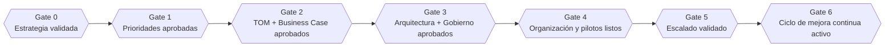

# 03 · Roles, RACI y Modelo de Gobierno

## 1. Roles típicos en un engagement AETP

| Rol | Perfil | Responsabilidad principal |
|---|---|---|
| **Sponsor Ejecutivo** | C-level del cliente | Valida estrategia, objetivos y aprueba gates de horizonte |
| **Lead Consultor (Partner)** | Consultora (ej. rol tipo Accenture Partner) | Dueño del engagement, garantiza valor de negocio y calidad metodológica |
| **Arquitecto Empresarial** | Consultora + cliente | Diseña TOM, arquitectura de negocio/aplicaciones |
| **Arquitecto de Datos/Cloud** | Consultora | Diseña arquitectura técnica, datos, integración |
| **Lead de Gobierno de Datos** | Cliente (Data Office/CDO) | Aprueba políticas de datos, calidad, linaje |
| **Lead de Gobierno de IA / Riesgo** | Cliente (Riesgo/Legal/Compliance) | Aprueba marco de IA responsable, límites de autonomía |
| **Dueño de Proceso (Process Owner)** | Cliente (negocio) | Valida rediseño de procesos y niveles de autonomía |
| **Lead de Cambio Organizacional** | Consultora + RRHH cliente | Diseña plan de upskilling, comunicación y adopción |
| **Product/Delivery Lead (AETP)** | Consultora | Gestiona el backlog de iniciativas y el roadmap en la plataforma |
| **Analista de Transformación** | Consultora (equipo core) | Ejecuta assessments, gap analysis, documentación de artefactos |

## 2. RACI por Horizonte

R = Responsable (ejecuta) · A = Aprueba (accountable) · C = Consultado · I = Informado

| Horizonte | Sponsor Ejecutivo | Lead Consultor | Arquitecto Empresarial | Gob. Datos | Gob. IA/Riesgo | Dueño de Proceso | Lead de Cambio |
|---|---|---|---|---|---|---|---|
| 0. Fundamento Estratégico | A | R | C | I | I | C | I |
| 1. Diagnóstico | A | R | C | C | C | R | I |
| 2. Diseño del Modelo Operativo | A | R | R | C | C | R | C |
| 3. Arquitectura | I | C | R | A | A | I | I |
| 4. Habilitación Organizacional | A | C | I | I | I | C | R |
| 5. Entrega y Escalado | A | R | C | C | A | R | C |
| 6. Sostenimiento | A | C | I | R | R | C | C |

> Nota: en Arquitectura (H3) y Sostenimiento (H6), el **gobierno de datos e IA/riesgo
> son "Accountable"** — refleja el principio "Gobierno antes que autonomía": ningún
> avance de arquitectura o de escalado de autonomía se aprueba sin su firma.

## 3. Gates de decisión (Stage Gates)

Cada horizonte termina en un **gate** formal — una decisión Go/No-Go/Recycle tomada por
el Sponsor Ejecutivo con el Lead Consultor, basada en evidencia trazable:

Criterios estándar para pasar cualquier gate:
1. Todos los entregables maestros del horizonte están completos y trazables.
2. No hay `CapabilityGap` crítico sin plan de mitigación.
3. Gobierno de datos/IA no tiene objeciones abiertas de "alto riesgo".
4. El Sponsor Ejecutivo firma el avance (registrado en AETP como evento de auditoría).

## 4. Modelo de Gobierno Continuo (Horizonte 6)

- **Cadencia**: revisión trimestral de madurez y KPIs de autonomía por dominio.
- **Triggers de re-entrada al ciclo**: cambio de estrategia, nueva regulación de IA,
  KPI de `TransformationOutcome` por debajo del umbral, nueva oportunidad tecnológica.
- **Auditoría**: cada incremento en `Process.autonomy_level` debe quedar registrado con
  el marco de gobierno de IA vigente en ese momento (versión), para trazabilidad legal.
- **Mejora continua**: hallazgos de Fase 21 retroalimentan Fase 1-3 del siguiente
  dominio o ciclo, cerrando el loop de transformación continua.
