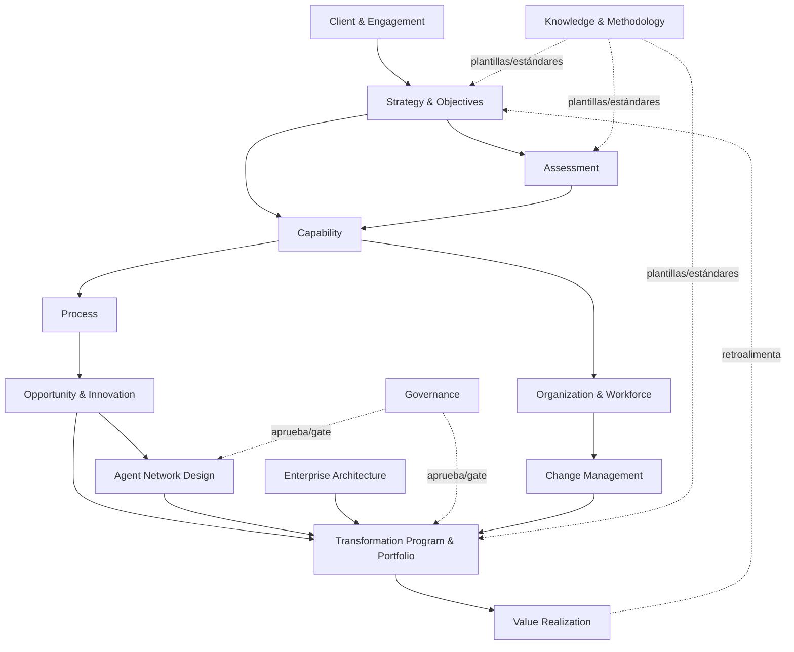
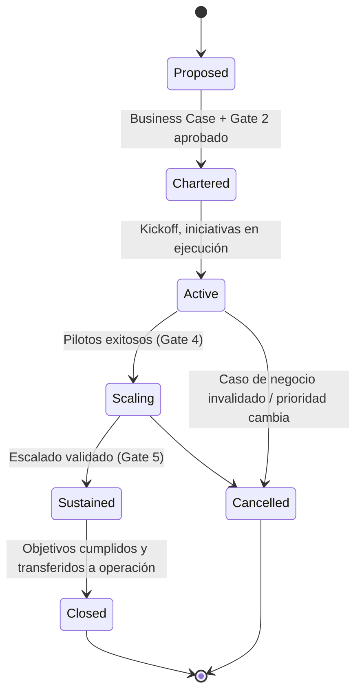
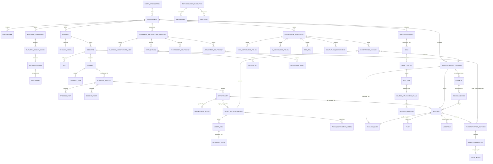

# 04 · Domain Model V1 (DDD)

> Alcance: **solo modelo de dominio de negocio** (DDD conceptual). No incluye SQL,
> esquemas de base de datos, APIs ni código de implementación — ver
> [02-traceability-model.md](./02-traceability-model.md) para la primera aproximación
> de datos, que este documento reemplaza/expande a nivel de dominio completo.

---

## 1. Core Domain

El **Core Domain** de AETP es la cadena de **trazabilidad y orquestación de la
transformación**: lo que ninguna herramienta genérica de consultoría, PPM o BPM ofrece
junto — decisión de negocio → diseño de red de agentes alineada al negocio → iniciativa
financiada → resultado medido, todo enlazado y auditable.

### Strategy
- **Purpose**: representar la estrategia de negocio que da origen y legitimidad a toda
  la transformación.
- **Description**: contiene visión, ventaja competitiva buscada y horizonte temporal.
  Es la raíz de la trazabilidad.
- **Business Owner**: Sponsor Ejecutivo / Oficina de Estrategia Corporativa del cliente.
- **Lifecycle**: `Draft → Validated → Active → Superseded`.
- **Key Relationships**: origina uno o más `Objective`; pertenece a un `Engagement`.

### Objective
- **Purpose**: traducir la estrategia en metas medibles (KPI + meta + horizonte).
- **Description**: unidad mínima de intención de negocio que justifica cualquier
  capacidad, proceso u oportunidad aguas abajo.
- **Business Owner**: Líder de Unidad de Negocio.
- **Lifecycle**: `Draft → Approved → Active → Achieved | Retired`.
- **Key Relationships**: pertenece a `Strategy`; requiere una o más `Capability`; se
  mide finalmente por `TransformationOutcome`.

### Capability
- **Purpose**: describir "qué debe poder hacer la empresa" independientemente de cómo
  lo hace hoy.
- **Description**: unidad de negocio-tecnología-agnóstica con madurez actual/objetivo;
  el puente entre estrategia y ejecución.
- **Business Owner**: Capability Owner (típicamente COO Office / Jefe de Función).
- **Lifecycle**: `Identified → Assessed → TargetDefined → Transformed`.
- **Key Relationships**: soporta un `Objective`; expone `CapabilityGap`; se ejecuta a
  través de uno o más `BusinessProcess`.

### BusinessProcess
- **Purpose**: representar el flujo de trabajo real (as-is/to-be) que materializa una
  capacidad.
- **Description**: contiene pasos, puntos de decisión y nivel de autonomía asignado
  (humano, asistido, agente-supervisado, autónomo).
- **Business Owner**: Process Owner (negocio).
- **Lifecycle**: `AsIsMapped → Redesigned → Piloted → Automated → Optimized`.
- **Key Relationships**: ejecuta una `Capability`; genera `Opportunity`; contiene
  `ProcessStep` y `DecisionPoint`.

### Opportunity
- **Purpose**: capturar una oportunidad concreta de mejora, IA o agente sobre un
  proceso.
- **Description**: incluye subtipos `AIOpportunity` y `AgenticOpportunity`; siempre
  puntuada por impacto/factibilidad antes de convertirse en iniciativa.
- **Business Owner**: Innovation Lead / Consultor de Transformación.
- **Lifecycle**: `Identified → Scored → Prioritized → Converted | Rejected`.
- **Key Relationships**: nace de un `BusinessProcess`; se convierte en `Initiative`;
  puede originar un `AgentNetworkDesign` si es de tipo agéntica.

### AgentNetworkDesign
- **Purpose**: diseñar (no desplegar) la red de agentes de negocio que soportará
  procesos priorizados.
- **Description**: blueprint conceptual de roles de agente, orquestación e
  interacción humano-agente-sistema — el diferenciador central de AETP frente a un
  agent builder.
- **Business Owner**: Arquitecto Empresarial + Lead de Gobierno de IA.
- **Lifecycle**: `Draft → Reviewed → Approved → Superseded`.
- **Key Relationships**: originado por `AgenticOpportunity`; contiene `AgentRole` y
  `AgentInteractionModel`; referenciado por `Initiative`.

### Initiative
- **Purpose**: representar el proyecto/programa financiado y ejecutable que
  materializa una oportunidad.
- **Description**: unidad de inversión con costo/valor estimado, dueño y estado.
- **Business Owner**: Sponsor de Iniciativa.
- **Lifecycle**: `Proposed → Approved → InProgress → Piloted → Scaled → Completed | Cancelled`.
- **Key Relationships**: convierte una `Opportunity`; pertenece a un
  `TransformationProgram`; se secuencia en un `Roadmap`; produce
  `TransformationOutcome`.

### TransformationProgram
- **Purpose**: agrupar iniciativas relacionadas en un esfuerzo coherente de
  transformación (ej. por dominio o unidad de negocio).
- **Description**: el contenedor de gobierno de más alto nivel bajo el `Engagement`.
- **Business Owner**: Program Director / Comité Directivo (Steering Committee).
- **Lifecycle**: `Proposed → Chartered → Active → Scaling → Sustained → Closed`.
- **Key Relationships**: pertenece a `Engagement`; contiene `Initiative`, `Roadmap`,
  `BusinessCase`; gobernado por `GovernanceFramework`.

### Roadmap
- **Purpose**: secuenciar en el tiempo las iniciativas de un programa.
- **Description**: organizado en `RoadmapPhase` (horizontes), cada una con criterios
  de entrada/salida (gates).
- **Business Owner**: Lead Consultor de Transformación.
- **Lifecycle**: `Draft → Approved → InExecution → Revised → Archived`.
- **Key Relationships**: pertenece a `TransformationProgram`; contiene
  `RoadmapPhase`; secuencia `Initiative`.

### BusinessCase
- **Purpose**: cuantificar el valor y costo de una iniciativa o programa antes de
  aprobarlo.
- **Description**: contiene supuestos, ROI, payback, y vínculo directo al `Objective`
  que justifica la inversión.
- **Business Owner**: Oficina de Valor / Finanzas.
- **Lifecycle**: `Draft → Reviewed → Approved → Realized | Revised`.
- **Key Relationships**: soporta `Initiative` y/o `TransformationProgram`; referencia
  `Objective`.

### TransformationOutcome
- **Purpose**: cerrar el ciclo de trazabilidad midiendo el resultado real frente al
  objetivo original.
- **Description**: evidencia cuantificada (KPI logrado, referencia de evidencia,
  fecha) que retroalimenta la estrategia.
- **Business Owner**: Oficina de Realización de Valor / Sponsor Ejecutivo.
- **Lifecycle**: `Measured → Validated → Reported → ReflectedInStrategy`.
- **Key Relationships**: producido por `Initiative`; referencia `Objective`; alimenta
  `BenefitRealization`.

---

## 2. Supporting Domains

Dominios necesarios para que el Core Domain funcione, pero que no son el
diferenciador competitivo (podrían apoyarse en prácticas/estándares de mercado):

| Dominio de soporte | Rol respecto al Core Domain |
|---|---|
| **Client & Engagement** | Contexto multi-tenant: qué cliente, qué compromiso de consultoría, qué stakeholders |
| **Assessment** | Mide madurez actual para alimentar `Capability`/`CapabilityGap` |
| **Enterprise Architecture** | Ancla iniciativas a componentes de negocio/aplicación/tecnología/datos reales |
| **Data & AI Governance** | Controla qué niveles de autonomía y qué datos pueden usarse (gate obligatorio) |
| **Organization & Workforce** | Diseño organizacional, brechas de habilidades, upskilling |
| **Change Management** | Adopción, comunicación, gestión de resistencia |
| **Risk & Compliance** | Registro de riesgos y requisitos regulatorios que restringen el diseño |
| **Value Realization** | Seguimiento de beneficios más allá del resultado puntual (tendencia, sostenibilidad) |
| **Knowledge & Methodology** | Framework, plantillas y playbooks reutilizables entre engagements (activo de la consultora, no del cliente) |

---

## 3. Bounded Contexts

Cada contexto tiene su propio lenguaje ubicuo y modelo interno; se integran entre sí
mediante los IDs de las entidades de trazabilidad (relaciones "aguas arriba/abajo").

### Client & Engagement Context
- **Purpose**: gestionar qué cliente y qué compromiso de consultoría enmarca todo lo
  demás (multi-tenant).
- **Primary Entities**: `ClientOrganization`, `Engagement`, `Stakeholder`.
- **Inputs**: alta de cliente, contrato de engagement, lista de stakeholders.
- **Outputs**: contexto raíz (`engagementId`) consumido por todos los demás contextos.
- **Dependencies**: ninguna (contexto raíz).

### Strategy & Objectives Context
- **Purpose**: capturar estrategia, modelo de negocio y objetivos medibles.
- **Primary Entities**: `Strategy`, `BusinessModel`, `Objective`, `KPI`.
- **Inputs**: entrevistas ejecutivas, planes estratégicos, KPIs corporativos.
- **Outputs**: `Objective` aprobado — ancla para Capability y Assessment.
- **Dependencies**: Client & Engagement.

### Assessment Context
- **Purpose**: medir madurez empresarial y tecnológica por dominio.
- **Primary Entities**: `MaturityAssessment`, `MaturityDomain`, `MaturityDomainScore`,
  `Benchmark`.
- **Inputs**: `Objective` (qué dominios evaluar), respuestas de assessment,
  benchmarks de mercado.
- **Outputs**: scores de madurez actual/objetivo — alimentan `CapabilityGap`.
- **Dependencies**: Strategy & Objectives.

### Capability Context
- **Purpose**: modelar el mapa de capacidades de negocio y sus brechas.
- **Primary Entities**: `Capability`, `CapabilityMap`, `CapabilityGap`.
- **Inputs**: `Objective`, resultados de `Assessment`.
- **Outputs**: capacidades priorizadas — input para Process y Opportunity.
- **Dependencies**: Strategy & Objectives, Assessment.

### Process Context
- **Purpose**: mapear y rediseñar procesos as-is/to-be.
- **Primary Entities**: `BusinessProcess`, `ProcessStep`, `DecisionPoint`.
- **Inputs**: `Capability`, talleres de mapeo de procesos.
- **Outputs**: procesos to-be con puntos de decisión — generan `Opportunity`.
- **Dependencies**: Capability.

### Opportunity & Innovation Context
- **Purpose**: identificar, puntuar y priorizar oportunidades de mejora/IA/agentes.
- **Primary Entities**: `Opportunity`, `AIOpportunity`, `AgenticOpportunity`,
  `OpportunityScore`.
- **Inputs**: `BusinessProcess`, criterios de scoring (impacto/factibilidad).
- **Outputs**: oportunidades priorizadas — convertidas en `Initiative` o en
  `AgentNetworkDesign`.
- **Dependencies**: Process.

### Agent Network Design Context
- **Purpose**: diseñar (conceptualmente) la red de agentes y su interacción con
  humanos y sistemas — **sin ejecutar ni desplegar nada**.
- **Primary Entities**: `AgentNetworkDesign`, `AgentRole`, `AgentInteractionModel`,
  `AutonomyLevel`.
- **Inputs**: `AgenticOpportunity`, `BusinessProcess` (puntos de decisión).
- **Outputs**: blueprint de agentes con niveles de autonomía propuestos — sujeto a
  aprobación de AI Governance.
- **Dependencies**: Opportunity & Innovation, AI Governance (aprobación de gate).

### Enterprise Architecture Context
- **Purpose**: representar el panorama de negocio, aplicaciones, tecnología y datos.
- **Primary Entities**: `EnterpriseArchitectureBaseline`, `BusinessArchitectureView`,
  `ApplicationComponent`, `TechnologyComponent`, `DataDomain`, `DataEntity`,
  `IntegrationPoint`.
- **Inputs**: inventarios existentes del cliente, TOM diseñado.
- **Outputs**: componentes de arquitectura ligados a `Initiative` (para trazar qué se
  transforma técnicamente).
- **Dependencies**: Capability (vía TOM).

### Governance Context
- **Purpose**: definir y hacer cumplir políticas de datos, IA, riesgo y cumplimiento.
- **Primary Entities**: `GovernanceFramework`, `DataGovernancePolicy`,
  `AIGovernancePolicy`, `RiskItem`, `ComplianceRequirement`, `GovernanceDecision`.
- **Inputs**: regulaciones, apetito de riesgo del cliente, diseños a aprobar
  (`AgentNetworkDesign`, `Initiative`).
- **Outputs**: aprobaciones/gates (`GovernanceDecision`) — condicionan avance de
  `AgentNetworkDesign` e `Initiative`.
- **Dependencies**: transversal — consultado por casi todos los contextos.

### Organization & Workforce Context
- **Purpose**: rediseñar la organización y cerrar brechas de habilidades.
- **Primary Entities**: `OrganizationUnit`, `Role`, `SkillProfile`, `SkillGap`.
- **Inputs**: TOM, capacidades objetivo.
- **Outputs**: nueva estructura y brechas de skills — input para Change Management.
- **Dependencies**: Capability.

### Change Management Context
- **Purpose**: gestionar adopción, comunicación y capacitación.
- **Primary Entities**: `ChangeManagementPlan`, `TrainingProgram`.
- **Inputs**: `SkillGap`, `Initiative` en curso.
- **Outputs**: planes de capacitación y adopción ejecutados junto a las iniciativas.
- **Dependencies**: Organization & Workforce, Transformation Program & Portfolio.

### Transformation Program & Portfolio Context
- **Purpose**: orquestar iniciativas, roadmap y business case como cartera de
  inversión.
- **Primary Entities**: `TransformationProgram`, `Initiative`, `BusinessCase`,
  `Roadmap`, `RoadmapPhase`, `Pilot`, `Milestone`.
- **Inputs**: `Opportunity` convertidas, `GovernanceDecision` (gates).
- **Outputs**: cartera ejecutable con secuencia temporal — la fuente de ejecución
  real de la transformación.
- **Dependencies**: Opportunity & Innovation, Governance, Enterprise Architecture.

### Value Realization Context
- **Purpose**: medir y reportar resultados y beneficios reales.
- **Primary Entities**: `TransformationOutcome`, `BenefitRealization`, `ValueMetric`.
- **Inputs**: `Initiative` completadas/piloteadas, KPIs objetivo.
- **Outputs**: evidencia de valor — retroalimenta `Objective`/`Strategy`.
- **Dependencies**: Transformation Program & Portfolio, Strategy & Objectives.

### Knowledge & Methodology Context
- **Purpose**: mantener el framework metodológico, plantillas y playbooks como activo
  reutilizable entre engagements.
- **Primary Entities**: `MethodologyFramework`, `Deliverable`, `Playbook`.
- **Inputs**: lecciones aprendidas de engagements pasados.
- **Outputs**: plantillas/estándares reutilizados por todos los demás contextos.
- **Dependencies**: ninguna funcional directa (activo transversal de la consultora).



---

## 4. Domain Entity Catalog

57 entidades, organizadas por contexto. `Parent Entity` indica la relación de
composición/agregación principal (no excluye otras relaciones listadas en las
secciones anteriores).

| # | Entity | Description | Context | Parent Entity | Child Entities |
|---|---|---|---|---|---|
| 1 | `ClientOrganization` | Organización cliente de la consultora | Client & Engagement | — (raíz) | Engagement |
| 2 | `Engagement` | Compromiso/proyecto de consultoría específico con el cliente | Client & Engagement | ClientOrganization | Stakeholder, Strategy, MaturityAssessment, TransformationProgram, EnterpriseArchitectureBaseline, GovernanceFramework, OrganizationUnit |
| 3 | `Stakeholder` | Persona con interés/rol en el engagement | Client & Engagement | Engagement | — |
| 4 | `Strategy` | Estrategia de negocio que ancla la transformación | Strategy & Objectives | Engagement | Objective, BusinessModel |
| 5 | `BusinessModel` | Modelo de negocio (ej. Business Model Canvas) | Strategy & Objectives | Strategy | — |
| 6 | `Objective` | Objetivo medible derivado de la estrategia | Strategy & Objectives | Strategy | KPI, Capability |
| 7 | `KPI` | Indicador clave de desempeño de un objetivo | Strategy & Objectives | Objective | — |
| 8 | `MaturityAssessment` | Evaluación de madurez de un engagement | Assessment | Engagement | MaturityDomainScore |
| 9 | `MaturityDomain` | Dimensión de madurez evaluada (taxonomía de referencia) | Assessment | — (catálogo) | MaturityDomainScore, Benchmark |
| 10 | `MaturityDomainScore` | Puntaje de un dominio en una evaluación concreta | Assessment | MaturityAssessment | — |
| 11 | `Benchmark` | Referencia sectorial de madurez | Assessment | MaturityDomain | — |
| 12 | `CapabilityMap` | Mapa completo de capacidades de un engagement | Capability | Engagement | Capability |
| 13 | `Capability` | Capacidad de negocio con madurez actual/objetivo | Capability | Objective / CapabilityMap | CapabilityGap, BusinessProcess |
| 14 | `CapabilityGap` | Brecha entre madurez actual y objetivo | Capability | Capability | — |
| 15 | `BusinessProcess` | Proceso de negocio as-is/to-be | Process | Capability | ProcessStep, DecisionPoint, Opportunity |
| 16 | `ProcessStep` | Paso individual de un proceso | Process | BusinessProcess | — |
| 17 | `DecisionPoint` | Punto de decisión humano/sistema/agente en un proceso | Process | BusinessProcess | — |
| 18 | `Opportunity` | Oportunidad de mejora identificada sobre un proceso | Opportunity & Innovation | BusinessProcess | OpportunityScore, Initiative |
| 19 | `AIOpportunity` | Especialización de `Opportunity` basada en IA no agéntica | Opportunity & Innovation | Opportunity | — |
| 20 | `AgenticOpportunity` | Especialización de `Opportunity` basada en agentes | Opportunity & Innovation | Opportunity | AgentNetworkDesign |
| 21 | `OpportunityScore` | Puntaje de impacto/factibilidad de una oportunidad | Opportunity & Innovation | Opportunity | — |
| 22 | `AgentNetworkDesign` | Blueprint de red de agentes de negocio | Agent Network Design | AgenticOpportunity | AgentRole, AgentInteractionModel |
| 23 | `AgentRole` | Rol de agente definido a nivel de negocio (conceptual) | Agent Network Design | AgentNetworkDesign | AutonomyLevel |
| 24 | `AgentInteractionModel` | Modelo de interacción Humano-Agente-Sistema | Agent Network Design | AgentNetworkDesign | — |
| 25 | `AutonomyLevel` | Nivel de autonomía asignado a un rol/proceso | Agent Network Design | AgentRole / BusinessProcess | — |
| 26 | `EnterpriseArchitectureBaseline` | Línea base de arquitectura empresarial del engagement | Enterprise Architecture | Engagement | BusinessArchitectureView, ApplicationComponent, TechnologyComponent, DataDomain |
| 27 | `BusinessArchitectureView` | Vista de arquitectura de negocio | Enterprise Architecture | EnterpriseArchitectureBaseline | — |
| 28 | `ApplicationComponent` | Componente de aplicación del panorama actual/objetivo | Enterprise Architecture | EnterpriseArchitectureBaseline | IntegrationPoint |
| 29 | `TechnologyComponent` | Componente tecnológico/infraestructura | Enterprise Architecture | EnterpriseArchitectureBaseline | — |
| 30 | `DataDomain` | Dominio de datos de negocio (ej. "Datos de Cliente") | Enterprise Architecture | EnterpriseArchitectureBaseline | DataEntity |
| 31 | `DataEntity` | Entidad de datos de negocio (conceptual) | Enterprise Architecture | DataDomain | — |
| 32 | `IntegrationPoint` | Punto de integración entre componentes | Enterprise Architecture | ApplicationComponent | — |
| 33 | `GovernanceFramework` | Marco de gobierno del engagement | Governance | Engagement | DataGovernancePolicy, AIGovernancePolicy, RiskItem, ComplianceRequirement, GovernanceDecision |
| 34 | `DataGovernancePolicy` | Política de gobierno de datos | Governance | GovernanceFramework | — |
| 35 | `AIGovernancePolicy` | Política de gobierno de IA/IA responsable | Governance | GovernanceFramework | — |
| 36 | `RiskItem` | Riesgo identificado relevante para la transformación | Governance | GovernanceFramework | — |
| 37 | `ComplianceRequirement` | Requisito regulatorio/normativo aplicable | Governance | GovernanceFramework | — |
| 38 | `GovernanceDecision` | Decisión/aprobación de gate registrada | Governance | GovernanceFramework | — |
| 39 | `OrganizationUnit` | Unidad organizativa (actual o rediseñada) | Organization & Workforce | Engagement | Role |
| 40 | `Role` (workforce) | Rol/puesto de trabajo humano | Organization & Workforce | OrganizationUnit | SkillProfile |
| 41 | `SkillProfile` | Perfil de habilidades requerido/actual de un rol | Organization & Workforce | Role | SkillGap |
| 42 | `SkillGap` | Brecha de habilidades identificada | Organization & Workforce | SkillProfile | — |
| 43 | `ChangeManagementPlan` | Plan de gestión del cambio | Change Management | Engagement / Initiative | TrainingProgram |
| 44 | `TrainingProgram` | Programa de capacitación/upskilling | Change Management | ChangeManagementPlan | — |
| 45 | `TransformationProgram` | Agrupación de iniciativas relacionadas | Transformation Program & Portfolio | Engagement | Initiative, Roadmap, BusinessCase |
| 46 | `Initiative` | Proyecto/iniciativa financiada y ejecutable | Transformation Program & Portfolio | Opportunity / TransformationProgram | Pilot, Milestone, TransformationOutcome |
| 47 | `BusinessCase` | Caso de negocio cuantificado | Transformation Program & Portfolio | Initiative / TransformationProgram | — |
| 48 | `Roadmap` | Secuencia temporal de iniciativas | Transformation Program & Portfolio | TransformationProgram | RoadmapPhase |
| 49 | `RoadmapPhase` | Fase/horizonte del roadmap | Transformation Program & Portfolio | Roadmap | Initiative (referenciada) |
| 50 | `Pilot` | Piloto o quick win de una iniciativa | Transformation Program & Portfolio | Initiative | — |
| 51 | `Milestone` | Hito de ejecución de una iniciativa | Transformation Program & Portfolio | Initiative | — |
| 52 | `TransformationOutcome` | Resultado medido de una iniciativa | Value Realization | Initiative | BenefitRealization |
| 53 | `BenefitRealization` | Seguimiento sostenido de beneficios en el tiempo | Value Realization | TransformationOutcome | ValueMetric |
| 54 | `ValueMetric` | Métrica individual de valor (financiero/operativo) | Value Realization | BenefitRealization | — |
| 55 | `MethodologyFramework` | El framework metodológico (21 fases) como activo reutilizable | Knowledge & Methodology | — (catálogo global) | Deliverable, Playbook |
| 56 | `Deliverable` | Plantilla/artefacto estándar de un entregable de fase | Knowledge & Methodology | MethodologyFramework | — |
| 57 | `Playbook` | Guía reutilizable de mejores prácticas por dominio/industria | Knowledge & Methodology | MethodologyFramework | — |

---

## 5. Strategic Traceability Model

Cadena completa, expandida desde la versión simplificada de
[02-traceability-model.md](./02-traceability-model.md):

```
ClientOrganization
 └─ Engagement
     └─ Strategy
         └─ Objective  ──────────────┐  (medido por KPI)
             └─ Capability            │
                 ├─ CapabilityGap      │  (diagnóstico, vía MaturityAssessment)
                 └─ BusinessProcess    │
                     ├─ DecisionPoint  │
                     └─ Opportunity ───┘
                         ├─ AIOpportunity
                         └─ AgenticOpportunity
                             └─ AgentNetworkDesign
                                 ├─ AgentRole (+ AutonomyLevel)
                                 └─ AgentInteractionModel
                         └─ Initiative  ◄── aprobado por GovernanceDecision
                             ├─ BusinessCase
                             ├─ Pilot
                             ├─ Milestone
                             └─ TransformationProgram
                                 └─ Roadmap
                                     └─ RoadmapPhase
                             └─ TransformationOutcome
                                 └─ BenefitRealization
                                     └─ ValueMetric
                                         └──► retroalimenta Objective / Strategy
```

### Tabla de la cadena (qué pregunta de negocio responde cada eslabón)

| Eslabón | Pregunta de negocio que responde |
|---|---|
| `Strategy` | ¿Por qué transformamos? |
| `Objective` | ¿Qué meta medible perseguimos? |
| `Capability` | ¿Qué debe poder hacer la empresa? |
| `CapabilityGap` | ¿Qué tan lejos estamos hoy? |
| `BusinessProcess` | ¿Cómo se ejecuta hoy/mañana esa capacidad? |
| `Opportunity` (AI/Agentic) | ¿Dónde hay una oportunidad concreta de mejora? |
| `AgentNetworkDesign` | ¿Qué red de agentes de negocio soportaría esa oportunidad, y con qué autonomía? |
| `Initiative` | ¿Qué vamos a financiar y ejecutar? |
| `BusinessCase` | ¿Vale la pena, en costo/beneficio? |
| `TransformationProgram` / `Roadmap` | ¿Cuándo y en qué secuencia? |
| `TransformationOutcome` | ¿Qué resultado real logramos? |
| `BenefitRealization` / `ValueMetric` | ¿El valor se sostiene en el tiempo? |
| → retroalimenta `Objective`/`Strategy` | ¿Debemos ajustar la estrategia u objetivos? |

Este es el "hilo dorado" (*golden thread*) que cualquier pantalla de AETP debe poder
mostrar en ambas direcciones (hacia atrás: justificación; hacia adelante: impacto).

---

## 6. Transformation Program Model

### Qué es un Transformation Program
Un **Transformation Program** es el contenedor de gobierno de más alto nivel dentro de
un `Engagement`: agrupa todas las `Initiative` necesarias para transformar un dominio,
unidad de negocio o capacidad end-to-end, de forma coherente y con un único caso de
negocio consolidado y un único roadmap.

No es un proyecto único — es una **cartera gobernada** de iniciativas relacionadas que
comparten objetivo, sponsor y ritmo de gobierno.

### Qué pertenece dentro de un Program
- Una o más `Initiative` (cada una convertida desde una `Opportunity`).
- Un `Roadmap` con sus `RoadmapPhase` (horizontes).
- Un `BusinessCase` consolidado (agregando los de cada iniciativa).
- Referencias a `GovernanceFramework` (políticas y gates aplicables).
- Referencias a `EnterpriseArchitectureBaseline` (qué componentes se transforman).
- Un `ChangeManagementPlan` asociado (adopción a nivel de programa).
- `Milestone`s de programa (distintos de los milestones de cada iniciativa).
- Métricas consolidadas de `TransformationOutcome`/`BenefitRealization`.

### Program Lifecycle



- **Proposed**: candidato identificado desde oportunidades priorizadas; sin
  financiamiento aún.
- **Chartered**: business case y TOM aprobados; sponsor y gobierno asignados.
- **Active**: iniciativas en ejecución, pilotos en curso.
- **Scaling**: pilotos validados, expansión multi-dominio/unidad de negocio.
- **Sustained**: operando en autonomía objetivo, bajo gobierno continuo (Fase 21).
- **Closed / Cancelled**: cierre formal, con lecciones aprendidas alimentando
  `Playbook`.

### Modelo de Gobierno del Program
- **Comité Directivo (Steering Committee)**: Sponsor Ejecutivo + Lead Consultor +
  dueños de las funciones de gobierno (Datos, IA/Riesgo) — aprueba cada
  `GovernanceDecision`/gate del program.
- **Cadencia**: revisión por horizonte (gate) + revisión de sostenimiento trimestral
  una vez en `Sustained` (ver [03-raci-governance.md](./03-raci-governance.md)).
- **Principio aplicado**: "Gobierno antes que autonomía" — un `Program` no puede pasar
  a `Scaling` sin `AIGovernancePolicy` y `DataGovernancePolicy` vigentes para los
  dominios involucrados.
- **Trazabilidad de gobierno**: toda transición de estado del program queda
  respaldada por al menos un `GovernanceDecision` registrado.

---

## 7. Relationship Diagram (Mermaid ER)



---

## Referencias cruzadas

- Metodología y fases: [01-methodology-horizons.md](./01-methodology-horizons.md)
- Modelo de trazabilidad simplificado (v0): [02-traceability-model.md](./02-traceability-model.md)
- RACI y gates de gobierno: [03-raci-governance.md](./03-raci-governance.md)
