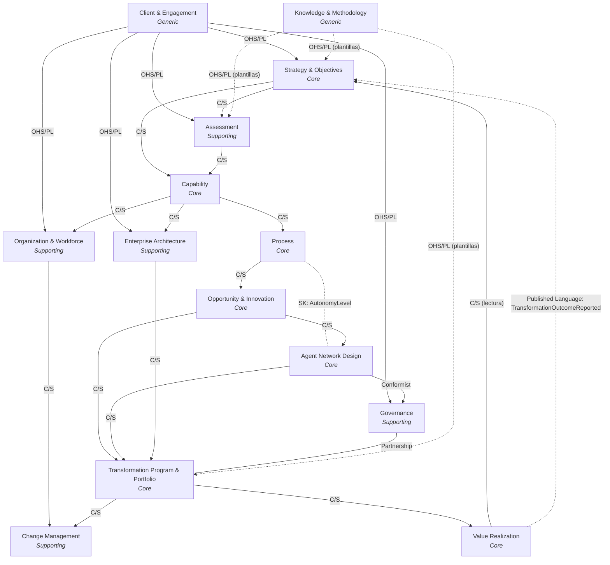

# 05 · Context Map (DDD)

> Alcance: **solo Context Map de Domain-Driven Design**. Deriva exclusivamente del
> modelo ya definido en [04-domain-model-v1.md](./04-domain-model-v1.md) (Core Domain,
> Supporting Domains, Bounded Contexts, catálogo de entidades). No incluye tablas SQL,
> APIs, pantallas React ni microservicios — eso se derivará en documentos posteriores
> (arquitectura lógica → base de datos → backend .NET 9 → frontend React).

---

## Cómo leer este documento

Para cada Bounded Context se documentan los 10 aspectos solicitados:

1. Nombre
2. Propósito
3. Responsabilidades
4. Entidades principales
5. Aggregate Roots
6. Value Objects
7. Eventos de dominio principales
8. Relaciones con otros contextos (con el patrón DDD de integración)
9. Ownership de datos
10. Nivel de prioridad (Core / Supporting / Generic Domain)

La clasificación Core/Supporting/Generic es la misma de
[04-domain-model-v1.md §1-2](./04-domain-model-v1.md): un contexto es **Core** si su
entidad principal figura en el Core Domain (la cadena de trazabilidad y orquestación),
**Supporting** si es necesario pero no diferenciador, y **Generic** si es una
capacidad de plataforma SaaS estándar (multi-tenancy, gestión de contenido) que
podría resolverse con productos de mercado.

---

## 1. Client & Engagement Context

1. **Nombre**: Client & Engagement Context
2. **Propósito**: gestionar qué cliente y qué compromiso de consultoría (engagement)
   enmarca todo lo demás; es el contexto raíz multi-tenant de la plataforma.
3. **Responsabilidades**: alta y gestión de organizaciones cliente; apertura/cierre de
   engagements; registro de stakeholders y su rol en el engagement; aislamiento de
   datos entre tenants.
4. **Entidades principales**: `ClientOrganization`, `Engagement`, `Stakeholder`.
5. **Aggregate Roots**: `ClientOrganization`, `Engagement`.
6. **Value Objects**: `TenantId`, `EngagementCode`, `ContactInfo`, `EngagementStatus`.
7. **Eventos de dominio principales**: `ClientOrganizationRegistered`,
   `EngagementStarted`, `StakeholderAssigned`, `EngagementClosed`.
8. **Relaciones con otros contextos**: **Upstream de todos los demás contextos** —
   publica el `EngagementId`/`TenantId` que todo dato de la plataforma debe portar.
   Patrón: **Open Host Service / Published Language** (todo contexto downstream
   consume el "lenguaje" de Engagement como Conformist implícito del identificador).
9. **Ownership de datos**: Platform Admin / Administrador de la consultora (dueño de
   la relación comercial con el cliente).
10. **Nivel de prioridad**: **Generic Domain** (multi-tenancy y gestión de clientes es
    una capacidad SaaS estándar, no diferenciadora).

---

## 2. Strategy & Objectives Context

1. **Nombre**: Strategy & Objectives Context
2. **Propósito**: capturar la estrategia de negocio, el modelo de negocio y los
   objetivos medibles que legitiman y anclan toda la transformación.
3. **Responsabilidades**: registrar visión/ventaja competitiva; modelar el business
   model; definir objetivos con KPI, meta y horizonte; aprobar y versionar la
   estrategia; recibir la retroalimentación de resultados (`TransformationOutcome`).
4. **Entidades principales**: `Strategy`, `BusinessModel`, `Objective`, `KPI`.
5. **Aggregate Roots**: `Strategy` (contiene `BusinessModel` como parte del agregado),
   `Objective` (agregado propio — se referencia masivamente desde otros contextos por
   ID y por eso no vive dentro del agregado `Strategy`).
6. **Value Objects**: `KpiDefinition` (nombre + unidad + fórmula), `TargetValue`,
   `TransformationHorizon` (enum: H0..H6), `StrategyStatement`.
7. **Eventos de dominio principales**: `StrategyDrafted`, `StrategyValidated`,
   `ObjectiveApproved`, `ObjectiveAchieved`, `StrategyRevisedFromOutcome`.
8. **Relaciones con otros contextos**:
   - Consume `Client & Engagement` (**Customer/Supplier**, downstream).
   - Es upstream de `Assessment`, `Capability` (**Customer/Supplier**, Strategy &
     Objectives como supplier).
   - Recibe retroalimentación de `Value Realization` (**Published Language** vía
     evento `TransformationOutcomeReported` — integración asíncrona, no llamada
     directa, para no acoplar el ciclo de vida de ambos contextos).
9. **Ownership de datos**: Sponsor Ejecutivo del cliente / Oficina de Estrategia
   Corporativa (dueño de negocio); Lead Consultor como custodio operativo en AETP.
10. **Nivel de prioridad**: **Core Domain**.

---

## 3. Assessment Context

1. **Nombre**: Assessment Context
2. **Propósito**: medir la madurez empresarial y tecnológica por dominio para
   establecer la línea base de la transformación.
3. **Responsabilidades**: ejecutar evaluaciones de madurez; puntuar cada dominio de
   madurez; comparar contra benchmarks de mercado; entregar el baseline que alimenta
   el análisis de brechas de capacidades.
4. **Entidades principales**: `MaturityAssessment`, `MaturityDomain`,
   `MaturityDomainScore`, `Benchmark`.
5. **Aggregate Roots**: `MaturityAssessment` (contiene `MaturityDomainScore` como
   entidades hijas). `MaturityDomain` y `Benchmark` son **datos de referencia**
   (catálogo compartido, no transaccional — se modelan como un pequeño agregado de
   catálogo separado, `MaturityDomainCatalog`).
6. **Value Objects**: `MaturityScoreValue` (escala 1-5), `MaturityDomainCode`,
   `AssessmentPeriod`.
7. **Eventos de dominio principales**: `MaturityAssessmentStarted`,
   `MaturityDomainScored`, `MaturityAssessmentCompleted`.
8. **Relaciones con otros contextos**:
   - Consume `Strategy & Objectives` para saber qué dominios evaluar (**Customer/
     Supplier**, downstream de Objective).
   - Es upstream de `Capability` (provee scores que alimentan `CapabilityGap`) —
     **Customer/Supplier**.
   - Benchmarks de mercado pueden provenir de fuentes externas → integradas vía
     **Anti-Corruption Layer (ACL)** para no contaminar el modelo interno con el
     formato de terceros.
9. **Ownership de datos**: Consultor de Transformación (Analista) ejecuta; Sponsor
   Ejecutivo del cliente valida el baseline.
10. **Nivel de prioridad**: **Supporting Domain**.

---

## 4. Capability Context

1. **Nombre**: Capability Context
2. **Propósito**: modelar el mapa de capacidades de negocio requeridas por los
   objetivos y sus brechas frente al estado actual.
3. **Responsabilidades**: mantener el catálogo de capacidades por engagement;
   registrar madurez actual/objetivo por capacidad; derivar y priorizar brechas
   (`CapabilityGap`); servir de puente entre estrategia y ejecución (procesos).
4. **Entidades principales**: `CapabilityMap`, `Capability`, `CapabilityGap`.
5. **Aggregate Roots**: `CapabilityMap` (agregador de alto nivel por engagement),
   `Capability` (agregado propio con `CapabilityGap` como entidad hija — se
   referencia masivamente desde `Process`, por eso es su propio agregado).
6. **Value Objects**: `MaturityLevel` (actual/objetivo, escala 1-5),
   `CapabilityCode`, `GapSeverity` (enum: Low/Medium/High/Critical).
7. **Eventos de dominio principales**: `CapabilityIdentified`,
   `CapabilityGapIdentified`, `CapabilityTargetDefined`, `CapabilityTransformed`.
8. **Relaciones con otros contextos**:
   - Consume `Strategy & Objectives` y `Assessment` (**Customer/Supplier**,
     agregando dos upstreams).
   - Es upstream de `Process` y de `Organization & Workforce` (**Customer/
     Supplier**).
9. **Ownership de datos**: Capability Owner del cliente (COO Office / Jefe de
   Función); Arquitecto Empresarial de la consultora como co-responsable del mapeo.
10. **Nivel de prioridad**: **Core Domain**.

---

## 5. Process Context

1. **Nombre**: Process Context
2. **Propósito**: mapear y rediseñar los procesos de negocio (as-is/to-be) que
   ejecutan una capacidad, incluyendo sus puntos de decisión.
3. **Responsabilidades**: levantar el proceso as-is; diseñar el proceso to-be;
   identificar puntos de decisión humano/sistema/agente; asignar nivel de autonomía
   objetivo por punto de decisión; generar oportunidades de mejora.
4. **Entidades principales**: `BusinessProcess`, `ProcessStep`, `DecisionPoint`.
5. **Aggregate Roots**: `BusinessProcess` (contiene `ProcessStep` y `DecisionPoint`
   como entidades hijas dentro del mismo agregado — no se referencian
   individualmente desde otros contextos).
6. **Value Objects**: `AutonomyLevel` (Manual / Assisted / Agent-Supervised /
   Autonomous — **Value Object compartido** con Agent Network Design Context),
   `ProcessState` (AsIs/ToBe), `ProcessSequenceNumber`.
7. **Eventos de dominio principales**: `ProcessAsIsMapped`, `ProcessRedesigned`,
   `ProcessPiloted`, `ProcessAutomated`, `ProcessOptimized`.
8. **Relaciones con otros contextos**:
   - Consume `Capability` (**Customer/Supplier**, downstream).
   - Es upstream de `Opportunity & Innovation` (**Customer/Supplier**).
   - Comparte el Value Object `AutonomyLevel` con `Agent Network Design`
     (**Shared Kernel** acotado a este único tipo, para garantizar que "nivel de
     autonomía" signifique exactamente lo mismo en ambos contextos).
9. **Ownership de datos**: Process Owner del cliente (negocio); Consultor de
   Transformación facilita el rediseño.
10. **Nivel de prioridad**: **Core Domain**.

---

## 6. Opportunity & Innovation Context

1. **Nombre**: Opportunity & Innovation Context
2. **Propósito**: identificar, puntuar y priorizar oportunidades concretas de
   mejora, IA o agentes sobre los procesos rediseñados.
3. **Responsabilidades**: capturar oportunidades (genéricas, de IA o agénticas);
   puntuar impacto/factibilidad; priorizar el backlog de oportunidades; decidir la
   conversión a iniciativa o a diseño de red de agentes.
4. **Entidades principales**: `Opportunity`, `AIOpportunity`, `AgenticOpportunity`,
   `OpportunityScore`.
5. **Aggregate Roots**: `Opportunity` (raíz polimórfica; `AIOpportunity` y
   `AgenticOpportunity` son especializaciones del mismo agregado mediante un
   discriminador de tipo, no agregados separados).
6. **Value Objects**: `OpportunityScore` (impacto + factibilidad, 1-5 cada uno),
   `OpportunityType` (enum: Generic/AI/Agentic), `OpportunityStatus`.
7. **Eventos de dominio principales**: `OpportunityIdentified`,
   `OpportunityScored`, `OpportunityPrioritized`, `OpportunityConvertedToInitiative`,
   `OpportunityConvertedToAgentNetworkDesign`, `OpportunityRejected`.
8. **Relaciones con otros contextos**:
   - Consume `Process` (**Customer/Supplier**, downstream).
   - Es upstream de `Agent Network Design` (cuando `AgenticOpportunity`) y de
     `Transformation Program & Portfolio` (cuando se convierte en `Initiative`) —
     ambas **Customer/Supplier**.
9. **Ownership de datos**: Innovation Lead / Consultor de Transformación.
10. **Nivel de prioridad**: **Core Domain**.

---

## 7. Agent Network Design Context

1. **Nombre**: Agent Network Design Context
2. **Propósito**: diseñar — **nunca desplegar ni ejecutar** — la red conceptual de
   agentes de negocio y su interacción con humanos y sistemas para una oportunidad
   agéntica priorizada. Es el diferenciador central de AETP frente a un agent
   builder.
3. **Responsabilidades**: definir roles de agente a nivel de negocio; especificar el
   modelo de interacción Humano-Agente-Sistema; proponer niveles de autonomía por
   rol; someter el blueprint a aprobación de gobierno de IA.
4. **Entidades principales**: `AgentNetworkDesign`, `AgentRole`,
   `AgentInteractionModel`, `AutonomyLevel`.
5. **Aggregate Roots**: `AgentNetworkDesign` (contiene `AgentRole` y
   `AgentInteractionModel` como entidades hijas del mismo agregado).
6. **Value Objects**: `AutonomyLevel` (**Shared Kernel** con `Process`),
   `InteractionPattern` (enum: HITL/HOTL/Supervised-Autonomous/Full-Autonomous),
   `AgentRoleDescription`.
7. **Eventos de dominio principales**: `AgentNetworkDesignDrafted`,
   `AgentRoleDefined`, `AgentInteractionModelSpecified`,
   `AgentNetworkDesignSubmittedForApproval`, `AgentNetworkDesignApproved`,
   `AgentNetworkDesignSuperseded`.
8. **Relaciones con otros contextos**:
   - Consume `Opportunity & Innovation` (**Customer/Supplier**, downstream de
     `AgenticOpportunity`).
   - Depende de `Governance` para aprobación — patrón **Conformist**: este
     contexto debe conformarse íntegramente a las políticas de `AIGovernancePolicy`
     publicadas por Governance, sin negociar su propio modelo de autonomía fuera de
     ese marco.
   - Es upstream de `Transformation Program & Portfolio` (una vez aprobado, informa
     el diseño de la `Initiative`) — **Customer/Supplier**.
9. **Ownership de datos**: Arquitecto Empresarial (consultora) + Lead de Gobierno de
   IA del cliente (co-ownership obligatorio, dado el gate de aprobación).
10. **Nivel de prioridad**: **Core Domain**.

---

## 8. Enterprise Architecture Context

1. **Nombre**: Enterprise Architecture Context
2. **Propósito**: representar el panorama de negocio, aplicaciones, tecnología y
   datos del cliente, como referencia para anclar iniciativas de transformación.
3. **Responsabilidades**: documentar la línea base de arquitectura empresarial;
   mantener el inventario de componentes de aplicación, tecnología y dominios de
   datos; exponer puntos de integración; vincular componentes a iniciativas.
4. **Entidades principales**: `EnterpriseArchitectureBaseline`,
   `BusinessArchitectureView`, `ApplicationComponent`, `TechnologyComponent`,
   `DataDomain`, `DataEntity`, `IntegrationPoint`.
5. **Aggregate Roots**: `EnterpriseArchitectureBaseline` (agregador raíz por
   engagement); `ApplicationComponent` y `DataDomain` como **agregados propios más
   pequeños** (contienen `IntegrationPoint` y `DataEntity` respectivamente),
   referenciados desde el baseline por ID para evitar un agregado gigante.
6. **Value Objects**: `ComponentType` (enum), `ArchitectureLayer` (Business/App/
   Tech/Data), `IntegrationProtocol`.
7. **Eventos de dominio principales**: `ArchitectureBaselineCaptured`,
   `ApplicationComponentRegistered`, `DataDomainMapped`,
   `IntegrationPointIdentified`.
8. **Relaciones con otros contextos**:
   - Consume `Capability` (vía el Target Operating Model) — **Customer/Supplier**.
   - Es upstream de `Transformation Program & Portfolio` (ancla iniciativas a
     componentes reales) — **Customer/Supplier**.
   - Inventarios existentes del cliente (CMDB, catálogos de aplicaciones externos)
     se integran vía **Anti-Corruption Layer (ACL)** para no filtrar modelos de
     datos heredados hacia el dominio de AETP.
9. **Ownership de datos**: Arquitecto Empresarial / Arquitecto de Datos-Cloud de la
   consultora, validado por el CIO/CTO del cliente.
10. **Nivel de prioridad**: **Supporting Domain**.

---

## 9. Governance Context

1. **Nombre**: Governance Context
2. **Propósito**: definir y hacer cumplir las políticas de gobierno de datos, IA,
   riesgo y cumplimiento normativo que condicionan cualquier avance hacia mayor
   autonomía.
3. **Responsabilidades**: mantener el marco de gobierno del engagement; publicar
   políticas de datos e IA; registrar riesgos y requisitos de cumplimiento; emitir
   decisiones de gate (`GovernanceDecision`) que aprueban o bloquean avances.
4. **Entidades principales**: `GovernanceFramework`, `DataGovernancePolicy`,
   `AIGovernancePolicy`, `RiskItem`, `ComplianceRequirement`, `GovernanceDecision`.
5. **Aggregate Roots**: `GovernanceFramework` (contiene `DataGovernancePolicy`,
   `AIGovernancePolicy`, `RiskItem`, `ComplianceRequirement` y `GovernanceDecision`
   como entidades hijas — un único agregado de gobierno por engagement, dado que
   las decisiones de gate deben ser consistentes entre sí).
6. **Value Objects**: `PolicyVersion`, `RiskSeverity` (enum), `ComplianceStatus`,
   `GateOutcome` (enum: Approved/Rejected/ApprovedWithConditions).
7. **Eventos de dominio principales**: `GovernanceFrameworkEstablished`,
   `DataGovernancePolicyPublished`, `AIGovernancePolicyPublished`,
   `RiskItemRegistered`, `GovernanceDecisionIssued`.
8. **Relaciones con otros contextos**:
   - Es **Open Host Service / Published Language**: publica políticas y decisiones
     de gate que `Agent Network Design` y `Transformation Program & Portfolio`
     deben consumir como Conformist (no negocian el contenido de la política, solo
     se someten a ella).
   - Mantiene una relación de **Partnership** con `Transformation Program &
     Portfolio`: ambos equipos (gobierno y programa) deben coordinar activamente
     los gates de horizonte, ya que ninguno puede avanzar sin el otro.
9. **Ownership de datos**: Data Office/CDO del cliente (gobierno de datos);
   Riesgo/Legal/Compliance del cliente (gobierno de IA y riesgo).
10. **Nivel de prioridad**: **Supporting Domain** (necesario y gatillador de
    autonomía, pero no es en sí mismo el diferenciador de negocio de AETP).

---

## 10. Organization & Workforce Context

1. **Nombre**: Organization & Workforce Context
2. **Propósito**: rediseñar la estructura organizacional y cerrar las brechas de
   habilidades necesarias para operar el modelo objetivo.
3. **Responsabilidades**: modelar unidades organizativas actuales/objetivo; definir
   roles humanos y sus perfiles de habilidades; identificar brechas de skills.
4. **Entidades principales**: `OrganizationUnit`, `Role` (workforce),
   `SkillProfile`, `SkillGap`.
5. **Aggregate Roots**: `OrganizationUnit` (contiene `Role` como entidad hija);
   `SkillProfile` como agregado propio más pequeño (contiene `SkillGap`),
   referenciado por `Role` vía ID.
6. **Value Objects**: `SkillLevel` (escala), `OrgUnitCode`, `SkillCategory`.
7. **Eventos de dominio principales**: `OrganizationUnitRedesigned`,
   `RoleDefined`, `SkillGapIdentified`.
8. **Relaciones con otros contextos**:
   - Consume `Capability` (vía el Target Operating Model) — **Customer/Supplier**.
   - Es upstream de `Change Management` (**Customer/Supplier**): las brechas de
     habilidades detectadas aquí disparan planes de capacitación allá.
9. **Ownership de datos**: RRHH del cliente, con apoyo del Lead de Cambio
   Organizacional de la consultora.
10. **Nivel de prioridad**: **Supporting Domain**.

---

## 11. Change Management Context

1. **Nombre**: Change Management Context
2. **Propósito**: gestionar la adopción, comunicación y capacitación necesarias para
   que la organización absorba el cambio.
3. **Responsabilidades**: elaborar planes de gestión del cambio; diseñar y ejecutar
   programas de capacitación/upskilling; monitorear adopción.
4. **Entidades principales**: `ChangeManagementPlan`, `TrainingProgram`.
5. **Aggregate Roots**: `ChangeManagementPlan` (contiene `TrainingProgram` como
   entidad hija).
6. **Value Objects**: `AdoptionMetric`, `TrainingModality` (enum), `PlanStatus`.
7. **Eventos de dominio principales**: `ChangeManagementPlanCreated`,
   `TrainingProgramScheduled`, `TrainingProgramCompleted`.
8. **Relaciones con otros contextos**:
   - Consume `Organization & Workforce` (`SkillGap`) y `Transformation Program &
     Portfolio` (iniciativas en curso) — **Customer/Supplier** en ambos casos
     (agregador downstream de dos upstreams).
9. **Ownership de datos**: Lead de Cambio Organizacional de la consultora, con RRHH
   del cliente como co-responsable de ejecución.
10. **Nivel de prioridad**: **Supporting Domain**.

---

## 12. Transformation Program & Portfolio Context

1. **Nombre**: Transformation Program & Portfolio Context
2. **Propósito**: orquestar las iniciativas de transformación como una cartera
   gobernada, con su caso de negocio y secuencia temporal (roadmap).
3. **Responsabilidades**: agrupar iniciativas en programas; secuenciar el roadmap
   por horizontes; consolidar el business case; gestionar pilotos y milestones;
   hacer cumplir los gates de gobierno antes de escalar.
4. **Entidades principales**: `TransformationProgram`, `Initiative`, `BusinessCase`,
   `Roadmap`, `RoadmapPhase`, `Pilot`, `Milestone`.
5. **Aggregate Roots**: `TransformationProgram` (agregador de alto nivel), `Initiative`
   (agregado propio — contiene `Pilot` y `Milestone` como entidades hijas; se
   referencia individualmente desde `Value Realization`), `Roadmap` (agregado propio
   con `RoadmapPhase` como entidad hija). `BusinessCase` es una **entidad** que
   pertenece tanto a `Initiative` como opcionalmente a `TransformationProgram`
   (referenciada, no duplicada).
6. **Value Objects**: `InitiativeStatus`, `RoiEstimate` (costo/beneficio/payback),
   `ProgramHorizonWindow`.
7. **Eventos de dominio principales**: `InitiativeProposed`, `InitiativeApproved`,
   `BusinessCaseApproved`, `TransformationProgramChartered`, `RoadmapPublished`,
   `PilotCompleted`, `InitiativeScaled`, `TransformationProgramClosed`.
8. **Relaciones con otros contextos**:
   - Consume `Opportunity & Innovation` (**Customer/Supplier**) y
     `Agent Network Design` (**Customer/Supplier**, cuando la iniciativa es de tipo
     agéntica).
   - Mantiene **Partnership** con `Governance` (gates mutuamente vinculantes).
   - Consume `Enterprise Architecture` (**Customer/Supplier**) para anclar
     componentes técnicos.
   - Es upstream de `Change Management` y de `Value Realization`
     (**Customer/Supplier** en ambos casos).
9. **Ownership de datos**: Program Director / Comité Directivo (Steering
   Committee) — copropiedad entre Sponsor Ejecutivo del cliente y Lead Consultor.
10. **Nivel de prioridad**: **Core Domain**.

---

## 13. Value Realization Context

1. **Nombre**: Value Realization Context
2. **Propósito**: medir y reportar el resultado real de cada iniciativa frente al
   objetivo original, cerrando el ciclo de trazabilidad.
3. **Responsabilidades**: registrar el resultado de transformación de cada
   iniciativa; dar seguimiento sostenido a los beneficios en el tiempo; calcular
   métricas de valor; retroalimentar la estrategia y los objetivos.
4. **Entidades principales**: `TransformationOutcome`, `BenefitRealization`,
   `ValueMetric`.
5. **Aggregate Roots**: `TransformationOutcome` (contiene `BenefitRealization` y
   `ValueMetric` como entidades hijas del mismo agregado).
6. **Value Objects**: `KpiResult`, `EvidenceReference`, `ValueMetricType` (enum:
   Financiero/Operativo).
7. **Eventos de dominio principales**: `TransformationOutcomeMeasured`,
   `TransformationOutcomeValidated`, `TransformationOutcomeReported`,
   `BenefitRealizationTracked`.
8. **Relaciones con otros contextos**:
   - Consume `Transformation Program & Portfolio` (**Customer/Supplier**,
     downstream de `Initiative`).
   - Referencia `Strategy & Objectives` para saber contra qué objetivo medir
     (**Customer/Supplier**, consulta de solo lectura por ID).
   - Retroalimenta `Strategy & Objectives` mediante el evento
     `TransformationOutcomeReported` — patrón **Published Language** (integración
     asíncrona por eventos, no acoplamiento síncrono de agregados).
9. **Ownership de datos**: Oficina de Realización de Valor / Sponsor Ejecutivo del
   cliente.
10. **Nivel de prioridad**: **Core Domain**.

---

## 14. Knowledge & Methodology Context

1. **Nombre**: Knowledge & Methodology Context
2. **Propósito**: mantener el framework metodológico (las 21 fases), plantillas de
   entregables y playbooks como activo reutilizable de la consultora entre
   engagements.
3. **Responsabilidades**: versionar el framework metodológico; estandarizar
   plantillas de entregables por fase; documentar playbooks de mejores prácticas
   por dominio/industria; incorporar lecciones aprendidas de engagements cerrados.
4. **Entidades principales**: `MethodologyFramework`, `Deliverable`, `Playbook`.
5. **Aggregate Roots**: `MethodologyFramework` (contiene `Deliverable` y `Playbook`
   como entidades hijas).
6. **Value Objects**: `FrameworkVersion`, `DeliverableTemplateRef`,
   `IndustryTag`.
7. **Eventos de dominio principales**: `MethodologyFrameworkVersionPublished`,
   `DeliverableTemplateAdded`, `PlaybookPublished`.
8. **Relaciones con otros contextos**:
   - Es **Open Host Service / Published Language**: publica plantillas/estándares
     consumidos por `Strategy & Objectives`, `Assessment` y `Transformation Program
     & Portfolio` como Conformist opcional (los pueden usar tal cual o adaptarlos
     localmente sin romper el contrato de nomenclatura).
   - No tiene dependencias funcionales entrantes (activo transversal de la
     consultora, no del cliente — vive fuera del árbol `Engagement`).
9. **Ownership de datos**: Práctica/Capability Office de la consultora (activo
   corporativo, no del cliente).
10. **Nivel de prioridad**: **Generic Domain** (gestión de plantillas/contenido es
    una capacidad de plataforma estándar, aunque el *contenido* metodológico en sí
    sea propiedad intelectual valiosa de la consultora).

---

## Resumen de clasificación

| Bounded Context | Prioridad |
|---|---|
| Client & Engagement | Generic Domain |
| Strategy & Objectives | **Core Domain** |
| Assessment | Supporting Domain |
| Capability | **Core Domain** |
| Process | **Core Domain** |
| Opportunity & Innovation | **Core Domain** |
| Agent Network Design | **Core Domain** |
| Enterprise Architecture | Supporting Domain |
| Governance | Supporting Domain |
| Organization & Workforce | Supporting Domain |
| Change Management | Supporting Domain |
| Transformation Program & Portfolio | **Core Domain** |
| Value Realization | **Core Domain** |
| Knowledge & Methodology | Generic Domain |

---

## Context Map (diagrama)

Patrones DDD usados: **OHS/PL** (Open Host Service / Published Language),
**C/S** (Customer/Supplier), **Conformist**, **ACL** (Anti-Corruption Layer),
**Partnership**, **SK** (Shared Kernel).

---

## Notas de integración para las siguientes fases

Estas notas quedan registradas aquí para informar (sin diseñar todavía) los próximos
documentos de arquitectura lógica, base de datos, backend .NET y frontend React:

- El `EngagementId` (Client & Engagement) actúa como **clave de partición tenant**
  natural para el futuro modelo de datos multi-tenant en SQL Server.
- Los agregados marcados como propios y pequeños (`Objective`, `Capability`,
  `Opportunity`, `Initiative`, `AgentNetworkDesign`, `TransformationOutcome`, etc.)
  son candidatos naturales a **Aggregate Roots con su propio repositorio** en Clean
  Architecture (`IObjectiveRepository`, `ICapabilityRepository`, etc.).
- El **Shared Kernel** `AutonomyLevel` entre `Process` y `Agent Network Design`
  deberá materializarse como un único Value Object compartido a nivel de código
  (mismo ensamblado/paquete de dominio compartido), no duplicado en ambos contextos.
- Las integraciones marcadas **Published Language** (eventos de dominio) son
  candidatas a implementarse con un **outbox pattern** o bus de eventos in-proceso,
  para no acoplar síncronamente `Value Realization` con `Strategy & Objectives`.
- El **Partnership** entre `Governance` y `Transformation Program & Portfolio`
  implica que el futuro modelo de datos probablemente requiera una tabla/entidad de
  unión explícita (`GovernanceDecision` referenciando `TransformationProgram` o
  `Initiative`) en lugar de una simple FK unidireccional.

---

## Referencias cruzadas

- Domain Model V1: [04-domain-model-v1.md](./04-domain-model-v1.md)
- Metodología y fases: [01-methodology-horizons.md](./01-methodology-horizons.md)
- RACI y gates de gobierno: [03-raci-governance.md](./03-raci-governance.md)
