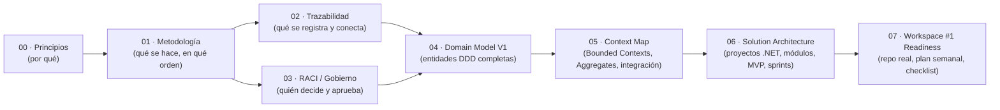

# AETP — Autonomous Enterprise Transformation Platform

## Framework de Consultoría (tipo Accenture / McKinsey)

Este directorio contiene el **framework metodológico** de AETP: la columna vertebral de
consultoría que guía a una organización desde la **Empresa Tradicional** hasta la
**Empresa Autónoma**.

> AETP **no** es un constructor de agentes. **No** despliega agentes. **No** ejecuta
> procesos de negocio. AETP es la plataforma que **orquesta y traza** el viaje de
> transformación empresarial: estrategia → capacidades → procesos → oportunidades de
> IA/agentes → iniciativas → roadmap → resultado transformacional.

## Índice

| Documento | Contenido |
|---|---|
| [00-overview-and-principles.md](./00-overview-and-principles.md) | Propósito, misión, principios de diseño |
| [01-methodology-horizons.md](./01-methodology-horizons.md) | Los 21 pasos agrupados en 7 horizontes, con objetivo/actividades/entregables/gate por fase |
| [02-traceability-model.md](./02-traceability-model.md) | Modelo de trazabilidad Estrategia→Objetivo→Capacidad→Proceso→Oportunidad→Iniciativa→Roadmap→Resultado, con diagrama y diccionario de entidades (v0, resumido) |
| [03-raci-governance.md](./03-raci-governance.md) | Roles, RACI por fase, y modelo de gobierno (Data, AI, Change) |
| [04-domain-model-v1.md](./04-domain-model-v1.md) | **Domain Model V1 (DDD)**: Core Domain, Supporting Domains, Bounded Contexts, catálogo de 57 entidades, trazabilidad estratégica completa, modelo de Transformation Program y diagrama ER |
| [05-context-map.md](./05-context-map.md) | **Context Map (DDD)**: los 14 Bounded Contexts con Aggregate Roots, Value Objects, eventos de dominio, relaciones (OHS/PL, Customer/Supplier, Conformist, ACL, Partnership, Shared Kernel) y nivel de prioridad |
| [06-solution-architecture-blueprint.md](./06-solution-architecture-blueprint.md) | **Solution Architecture Blueprint (MVP)**: proyectos .NET 9 (Clean Architecture + Modular Monolith), estructura de repositorio, módulos, alcance de MVP, estructura de frontend React, alcance de base de datos y roadmap de sprints |
| [07-workspace1-technical-foundations.md](./07-workspace1-technical-foundations.md) | **Technical Foundations & Workspace #1 Readiness**: árbol de repositorio listo para `git init`, solución .NET acotada a Identity+ClientEngagement+Strategy, alcance SQL inicial, estructura frontend y plan semana a semana (Semana 1-3) para dejar listo el terreno técnico del Workspace #1 |

## Cómo se relacionan los documentos

Empieza por [00-overview-and-principles.md](./00-overview-and-principles.md) si eres
nuevo en AETP, o ve directo a [01-methodology-horizons.md](./01-methodology-horizons.md)
si buscas el detalle fase por fase.
